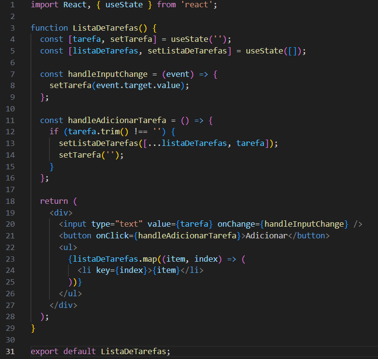

# ReactAula18

<h2>Exercício 01 </h1>

<h3>Explicação:</h3>

Linhas 1-2:

import React, { useState } from 'react';: Importa os módulos necessários do React. O useState é um hook que permite gerenciar o estado de um componente funcional.

Linhas 3-12:

function Contador() {}: Define uma função que representa um componente funcional chamado Contador.
const [numero, setNumero] = useState(0);:
Declara um estado usando o hook useState.
numero: Variável que armazena o valor atual do contador (inicialmente 0).
setNumero: Função para atualizar o valor de numero.
return: Retorna o JSX que será renderizado na tela.
div: Um elemento div que envolve todo o conteúdo do componente.
Exibe o valor atual do contador.
button: Dois botões: um para incrementar e outro para decrementar o contador. Ao clicar em cada botão, a função setNumero é chamada para atualizar o estado.

<h2>Exercício 02</h2>

<h3>Explicação:</h3>

Linhas 1-2:

import React, {useState} from 'react';: Importa os módulos necessários do React. O useState é um hook que permite gerenciar o estado de um componente funcional.

Linhas 3-8:

function BotaoAlternador() {}: Define uma função que representa um componente funcional chamado BotaoAlternador.
const [status, setStatus] = useState('ligado');:
Declara um estado usando o hook useState.
status: Variável que armazena o estado atual do botão (inicialmente 'ligado').
setStatus: Função para atualizar o valor de status.
const handleClick = () => {...}:
Define uma função que será chamada quando o botão for clicado.
A função utiliza um operador ternário para alternar o valor de status entre 'ligado' e 'desligado'.

Linhas 9-13:

return: Retorna o JSX que será renderizado na tela.

div: Um elemento div que envolve todo o conteúdo do componente.

button: Um botão que exibe o valor atual de status e chama a função handleClick quando clicado.

<h2>Exercício 03 </h2>

<h3>Explicação </h3>

Linhas 1-2:

import React, { useState } from 'react';: Importa os módulos necessários do React. O useState é um hook que permite gerenciar o estado de componentes funcionais.

Linha 3:

function ListaDeTarefas() {: Define a função componente que renderizará a lista de tarefas.
Gerenciando o Estado

Linhas 4-6:

const [tarefa, setTarefa] = useState('');: Cria um estado para armazenar o texto da tarefa que o usuário está digitando. Inicialmente, o valor é uma string vazia.
const [listaDeTarefas, setListaDeTarefas] = useState([]);: Cria um estado para armazenar a lista de tarefas. Inicialmente, a lista está vazia.
Handlers de Eventos

Linhas 7-10:

const handleInputChange = (event) => { ... }: Define um handler de eventos para o campo de entrada. Quando o usuário digita algo, o valor do estado tarefa é atualizado com o valor digitado.

Linhas 11-16:

const handleAdicionarTarefa = () => { ... }: Define um handler de eventos para o botão "Adicionar". Quando o botão é clicado, verifica se o campo de entrada não está vazio. Se estiver, a nova tarefa é adicionada ao final da lista de tarefas e o campo de entrada é limpo.
Renderização

Linhas 18-28:

return ( ... ): Retorna o JSX que será renderizado na tela.
input: Um campo de texto controlado pelo estado tarefa.
button: Um botão que, ao ser clicado, chama a função handleAdicionarTarefa.
ul: Uma lista não ordenada que renderiza cada item da lista de tarefas em um elemento li.