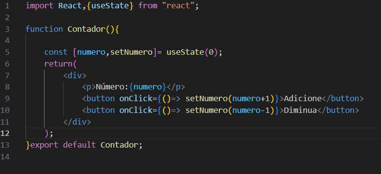
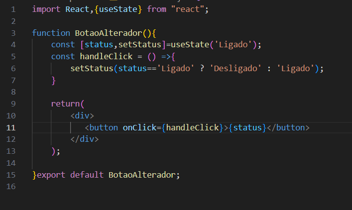

# ReactAula18

Explicação

Linhas 1-2:

import React, { useState } from 'react';: Importa os módulos necessários do React. O useState é um hook que permite gerenciar o estado de um componente funcional.

Linhas 3-12:

function Contador() {}: Define uma função que representa um componente funcional chamado Contador.
const [numero, setNumero] = useState(0);:
Declara um estado usando o hook useState.
numero: Variável que armazena o valor atual do contador (inicialmente 0).
setNumero: Função para atualizar o valor de numero.
return: Retorna o JSX que será renderizado na tela.
div: Um elemento div que envolve todo o conteúdo do componente.
Exibe o valor atual do contador.
button: Dois botões: um para incrementar e outro para decrementar o contador. Ao clicar em cada botão, a função setNumero é chamada para atualizar o estado.

<h2>Exercício 02</h2>

Explicando

Linhas 1-2:

import React, {useState} from 'react';: Importa os módulos necessários do React. O useState é um hook que permite gerenciar o estado de um componente funcional.

Linhas 3-8:

function BotaoAlternador() {}: Define uma função que representa um componente funcional chamado BotaoAlternador.
const [status, setStatus] = useState('ligado');:
Declara um estado usando o hook useState.
status: Variável que armazena o estado atual do botão (inicialmente 'ligado').
setStatus: Função para atualizar o valor de status.
const handleClick = () => {...}:
Define uma função que será chamada quando o botão for clicado.
A função utiliza um operador ternário para alternar o valor de status entre 'ligado' e 'desligado'.

Linhas 9-13:

return: Retorna o JSX que será renderizado na tela.
div: Um elemento div que envolve todo o conteúdo do componente.
button: Um botão que exibe o valor atual de status e chama a função handleClick quando clicado.